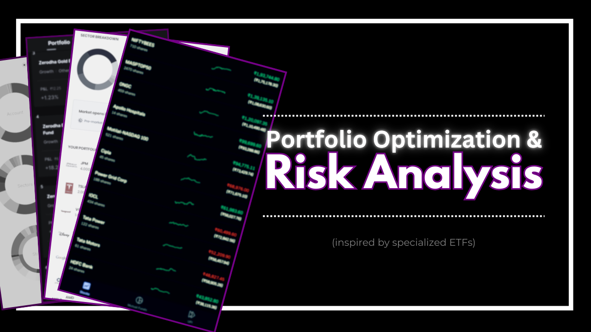
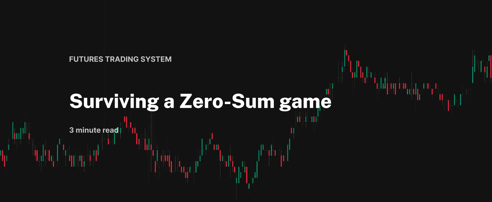

# Research Works

### [View Portfolio Optimization and Risk Analysis](https://github.com/s1dewalker/Portfolio_Analysis)
Inspired by many specialized ETFs. This project offers optimization and modeling tools for investment strategies. Leveraging Efficient Frontier modeling, Monte Carlo simulation, risk metrics (Sharpe ratio, VaR), and Fama French factor models w/ python libraries like pandas, yfinance, and PyPortfolioOpt.
#

### Surviving A Zero-Sum Game
Futures Trading System For Fixed Income Derivatives. A glimpse of the system that was used @ Futures First. This system utilized data analytics, quantitative analysis, and account management. It involved keeping an eagle eye on fixed income products w/ live Excel dashboards. Being prepared for a range of outcomes w/ risk scenario analysis. Changing the game w/ performance analysis, metrics, and stats. Applied ML and probability models to identify and predict market states, optimizing portfolio and risk assessment. Providing defense to account management w/ a resilient capital allocation system.
#
